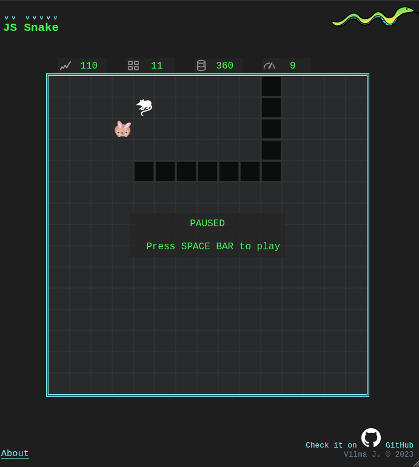

# 🪧 Vanilla JavaScript, HTML5 canvas Snake Game

## 📋 About

🌐 **Site published at**: [https://codevivi.github.io/JS-snake/index.html](https://codevivi.github.io/JS-snake/index.html)

JS practice project, snake game.

🎯 **Goals:**

My goal was to implement some functionality similar to nostalgic Nokia 'Snake' game.

✅ **Present functionality**

**_Attention:_** page will reload when resizing window, so better resize before starting game

- Move, eat, grow (after finished digesting), die on collision.
- Track score, record, length, speed.
- Food: mice and rabbits. Rabbits show up and disappear randomly.
- Fenced and free world modes.
- Settings (sound, grid visibility, fence, saving).
- Save to local storage.
- Control with keyboard (arrows or VIM (h,j,k,l) ) and touch controls for mobile.

